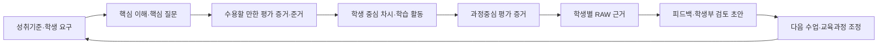

# 교육과정-수업-평가-기록 일체화 설계

## 참고 자료에서 반영한 원리

이 기능은 다음 첨부 자료의 공통 업무 흐름을 Obsidian의 Markdown 데이터 구조로 재구성한 것입니다.

- `schoolmaster (1).pdf`: 시수 편성, 학사일정·행사, 기초·연간시간표, 교과·창체 진도, 주간학습, 수행평가와 교과 종합의견으로 이어지는 운영 흐름
- `혁신수업N_아이클래스_교수평기일체화.pdf`: 교과 목표 확인, 성취기준 중심 재구성, 학생 참여 수업, 수업 과정 평가, 학생별 성장 기록의 5단계 흐름
- `교육과정-수업-평가 일체화의 이해-경기도교육청-2016.pdf`: 교육과정-수업-평가(기록)를 연속된 교육활동으로 보고 불일치를 줄이는 원리, 교과 내·교과 간 재구성, 이해중심 백워드 설계, 평가 결과의 피드백과 성찰
- `2022_개정_교육과정의_적용에_대비한_개념기반_탐구학습_설계_및_실행에_관한_연구.pdf`: 핵심 아이디어 중심 단원 설계, 개념적 렌즈와 개념망, 스트랜드별 일반화·안내 질문, 귀납적 탐구, 전이와 성찰, 실제 맥락 총합평가와 분석적 루브릭

핵심 원칙은 “같은 성취기준에서 수업 목표, 학습 활동, 평가 증거, 학생별 기록이 도출되어야 한다”는 것입니다. 플러그인은 네 영역을 단순히 한 화면에 모으는 것이 아니라 ID와 위키링크로 추적 가능한 관계로 저장합니다.

## 구현 데이터 흐름

### 통합 단원 설계

`교육과정/설계/`의 각 Markdown 노트는 다음 항목을 가집니다.

- 기본: 교과, 학년, 학기, 단원, 기간, 계획 시수, 운영 상태
- 교육과정: 성취기준, 학생 요구·삶의 맥락, 핵심역량, 연계 교과
- 바라는 결과: 핵심 이해, 핵심 질문
- 평가 계획: 수행·평가 과제, 평가요소·준거, 복수 평가방법
- 수업 계획: 차시 흐름과 학생 중심 학습 경험
- 환류·기록: 피드백·재도전 계획, 학생별 관찰·기록 초점

설계 방법은 교과 내 재구성, 교과 간·비교과 통합, 이해중심 백워드 설계 중에서 선택합니다.

### 차시 실행 기록

`교육과정/수업일지/`의 노트는 상위 단원을 `curriculumUnitId`와 `curriculumUnitPath` 위키링크로 참조합니다. 계획 단계의 수업 목표·활동과 실행 후의 학생 참여·평가 증거·피드백·교사 성찰을 같은 노트에서 비교합니다. 실행 완료된 시수만 단원의 운영 시수로 집계합니다.

## 개념기반 탐구학습 설계

통합 단원의 **개념기반 탐구학습 적용**을 활성화하면 다음 구조가 추가됩니다.

1. 단원 개요와 2022 개정 교육과정의 핵심 아이디어
2. 학습의 방향과 깊이를 정하는 개념적 렌즈
3. 교과를 가로지르는 매크로 개념과 교과 고유의 마이크로 개념
4. 개념 렌즈로 조직한 스트랜드와 개념망
5. 스트랜드별 일반화, 사실적·개념적·논쟁적 안내 질문
6. 일반화를 뒷받침하는 내용 지식과 탐구·전이에 필요한 핵심 기능
7. 사전학습 가시화와 학생 질문·선택·의사결정을 보장하는 주도성 계획
8. 참여·관계 맺기, 집중, 조사, 조직·정리, 일반화, 전이, 성찰의 단원 탐구 흐름
9. 실제 맥락의 전이 과제와 지식·이해/과정·기능/가치·태도 분석적 루브릭

개념적 질문은 스트랜드당 3~5개, 논쟁적 질문은 1~2개를 권장합니다. 일반화는 질문이나 활동명이 아니라 두 개 이상 개념의 관계를 나타내는 완결된 진술이어야 합니다. `실행 준비` 이상으로 전환할 때에는 핵심 아이디어·개념적 렌즈·스트랜드·일반화·전이 맥락·루브릭과 일반화/전이/성찰 단계가 갖추어져야 합니다.

차시 실행 기록은 상위 단원의 스트랜드와 주된 탐구 단계를 참조합니다. 일반화 단계 완료 시에는 학생이 실제로 형성한 일반화를, 전이 단계 완료 시에는 새로운 상황에 적용한 증거를 기록해야 합니다. 교사가 계획한 일반화 문장을 학생의 성취로 자동 복사하지 않습니다.

### 학생별 평가·기록 근거

학생부 RAW 근거에서 통합 단원과 차시를 선택하면 다음 값이 연결됩니다.

- 단원 ID·제목·원본 위키링크
- 차시 ID·원본 위키링크
- 교과, 성취기준, 평가요소·준거, 평가방법

학생이 실제로 보인 말·행동·산출물은 학생별로 별도 기록합니다. 공통 계획을 학생의 성취로 복사하지 않으며, 새 근거는 항상 `reviewStatus: raw`로 시작합니다.

## 자동 일체화 점검

연결도는 각 25점인 네 단계로 계산합니다.

1. 교육과정: 성취기준과 핵심 이해
2. 수업: 핵심 질문과 학습 경험
3. 평가: 수행 증거, 평가 준거, 평가방법
4. 기록·환류: 피드백 계획과 학생별 관찰 초점

성취기준·수업 계획·평가 증거·평가 준거가 빠지면 오류, 학생 요구·핵심 질문·평가방법·피드백·기록 초점이 빠지면 보완 경고로 표시합니다. `설계 중` 상태에서는 미완성 저장이 가능하지만 `실행 준비` 이상으로 바꿀 때에는 오류 항목을 먼저 채워야 합니다.

## 현재 범위와 다음 단계

현재 버전은 교사가 한 학급에서 통합 단원을 설계하고 실제 수업·평가·학생 기록을 연결하는 교실 수준의 핵심 흐름을 제공합니다. 차시는 통합 목록과 주간·월간 캘린더에도 나타납니다.

학교 수준의 시수 편제, 학사일정·휴업일·행사, 기초·연간시간표 자동 생성, 학교·학년 공동 공유는 별도 단계로 남겨 두었습니다. 이 기능들은 학교의 공식 편성 자료와 충돌할 가능성이 있으므로, 가져오기 형식·권한·변경 이력·종합 점검을 함께 설계한 뒤 추가합니다.
